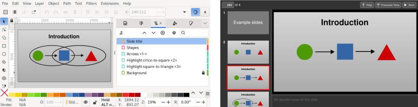

Slidie: An Inkscape-centered slide preparation tool
===================================================

*Slidie is a slide preparation system which makes illustrations easy and bullet
points hard.*

Slidie is a light-touch tool for converting a directory full of Inkscape SVGs
into a slide show to accompany a presentation.

Noteworthy features include:

* Slides are just ordinary (numbered) Inkscape SVG files
* No Inkscape plugins etc. are required
* Reveal complex diagrams step-by-step by adding
  [Beamer](https://en.wikipedia.org/wiki/Beamer_(LaTeX))-like annotations
  to Inkscape layer names.
* Export to multiple output formats (PDF, single-file browser-based viewer and
  PNG files)
* Hyperlinking between slides
* Speaker notes
* Presenter view
* Embedded videos and iframes
* Embedded fonts

Documentation
-------------

* [A guided tour of Slidie's main features](https://mossblaser.github.io/slidie/tour.html)

* [Slidie reference manual](https://mossblaser.github.io/slidie/)

Motivation
----------

Most of my slides are diagrams and drawings and yet every presentation tool
I've used has very limited (and often buggy) drawing facilities. As a result,
for years now I've been creating slides entirely in Inkscape: a tool which
excels at drawing and diagramming. Unfortunately, combining these into format
suitable for presenting (e.g. a PDF) is fairly tedious.

In the past I've used flaky GNU parallel one-liners to convert many SVGs into a
single PDF for presenting but this approach leaves much to be desired. In
particular, step-by-step builds often require duplicated SVG files with
different layers turned on and off but you don't need me to elaborate on the
many problems this leads to.

Slidie's raison d'etre is to provide a robust mechanism for combing slides and
handling builds involving showing/hiding combinations of layers. Using
[Beamer](https://en.wikipedia.org/wiki/Beamer_%28LaTeX%29)-inspired annotations
in Inkscape layer names, Slidie makes it possible to have a complex diagram
build-up step-by-step from a single Inkscape SVG file.

Everything else is just gravy.

Preemptive FAQ
--------------

### What about PowerPoint?

It's slow, it's buggy, it's drawing tools are awkward and limited, it comes in
three not-quite-compatible implementations (Windows, Mac and Web) and it costs
a lot of money.

### What about LibreOffice Impress?

Many of the same criticisms as PowerPoint apply, although it is fractionally
less buggy and costs a lot less money.

### What about Keynote?

I'm not a fan of MacOS and don't have a Mac so this isn't a practical option.

### What about JessyInk

[JessyInk](https://code.google.com/archive/p/jessyink/) is certainly a
spiritual ancestor of Slidie and probably what originally gave me the idea of
using Inkscape to create whole slides (not just the diagrams) in the first
place.

Unfortunately JessyInk is very constrained. Your slides must live in a single
file and layers are repurposed only for slide boundaries. There's also no way
to export to static formats like PDF. Further, bare SVG are not a good
distribution format since they do not natively support embedding of fonts.

### What about Beamer

Despite having [pulled a few stunts with Beamer and TikZ in the
past](http://jhnet.co.uk/misc/handWavyPCIe.pdf), I've reluctantly concluded it
usually just too slow to author for slides in most situations.

### What about non-Inkscape SVG authoring tools

They're cool too, but I just don't support them (yet). You can still use these
to create slides, but slidie's step-by-step build-up system currently depends
on Inkscape's layers mechanism and so this feature will not be usable.
