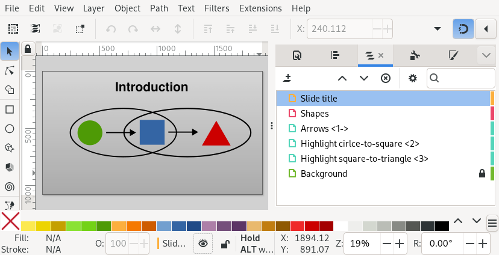
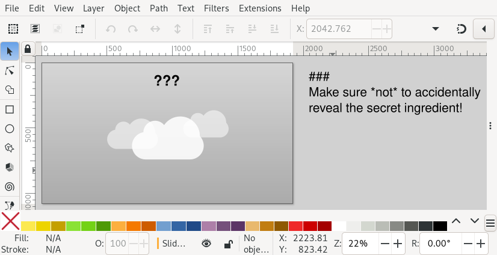
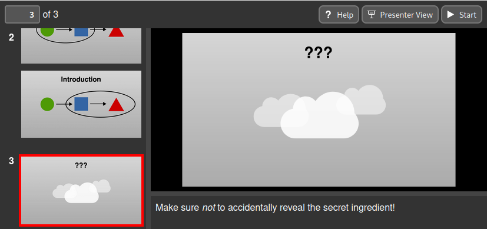
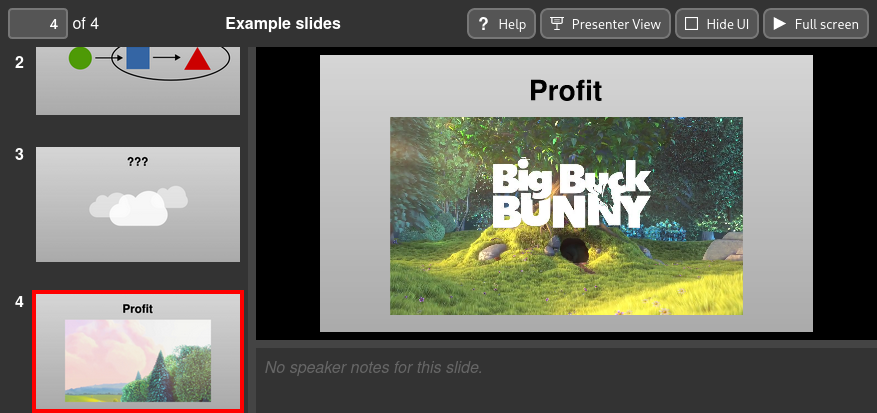

Slidie: An Inkscape-centered slide preparation tool
===================================================

*"A a slide preparation system which makes illustrations easy and bullet points
hard."*

Slidie is a light-touch tool for converting a directory full of Inkscape SVGs
into a slide show to accompany a presentation.

Noteworthy features include:

* Reveal complex diagrams step-by-step by adding
  [Beamer](https://en.wikipedia.org/wiki/Beamer_(LaTeX))-inspired annotations
  to Inkscape layer names.
* Export to multiple output formats (PDF, XHTML, loads of PNG files)
* Rich linking between slides
* Speaker notes
* Presenter view
* Video and iframes
* Embedded subset fonts

Motivation
----------

Most of my slides are diagrams and drawings and yet every presentation tool
I've used has very limited (and often buggy) drawing facilities. As a result,
for years now I've been creating slides entirely in Inkscape: a tool which
excels at drawing and diagramming. Unfortunately, combining these into format
suitable for presenting (e.g. a PDF) is fairly tedious.

In the past I've used flaky GNU parallel one-liners to convert many SVGs into a
single PDF for presenting but this approach leaves much to be desired. In
particular, step-by-step builds often require duplicated SVG files with
different layers turned on and off but you don't need me to elaborate on the
many problems this leads to.

Slidie's raison d'etre is to provide a robust mechanism for combing slides and
handling builds involving showing/hiding combinations of layers. Using
[Beamer](https://en.wikipedia.org/wiki/Beamer_%28LaTeX%29)-inspired annotations
in Inkscape layer names, Slidie makes it possible to have a complex diagram
build-up step-by-step from a single Inkscape SVG file.

Everything else is just gravy.

Documentation
-------------

**TODO: This is a work in progress: much of the explanatory documentation exists
in extensive docstrings in the sources.**

Quick-start
-----------

A Slidie presentation is just a bunch of numbered SVGs in a directory.

Create some slides, one per SVG, and save them into a directory with names
beginning with a number. Make sure to set your page size to a suitable aspect
ratio. [For example](./examples/getting_started):

    examples/getting_started/
     |- 00100 - Title.svg
     |- 00200 - Introduction.svg
     |- 00300 - ???.svg
     |- 00400 - Profit.svg

*Tip: Use BASIC-style line numbering for your file numbers, this makes it
easier to reorganise them later -- Slidie also provides the `slidie-mv` utility
to assist. You don't have to do this, though: Slidie will still order your
files correctly.*

You can then build the slide show into a single PDF or standalone web page
using:

    $ slidie examples/getting_started/ -o examples/getting_started.pdf
    $ slidie examples/getting_started/ -o examples/getting_started.xhtml

See [`examples/getting_started.pdf`](./examples/getting_started.pdf) and
[`examples/getting_started.xhtml`](./examples/getting_started.xhtml).

*Tip: The standalone web page files must have the `.xhtml` extension and not
just `.html`.*

The standalone XHTML page can be opened without a local web server and provides
a complete tool for running a presentation including a presenter view. More
dynamic features such as embedded videos only available in the XHTML output.

If you want to make a slide reveal certain layers to build up step-by-step, you
can add build step annotations in angle brackets to the layer name in Inkscape
[like so:

Slidie will render this SVG into four separate slides (build steps are numbered
from zero!):

*Tip: The build syntax is far more powerful (and ergonomic) than this quick
example lets on. See the rest of the documentation for more!*

To add speaker notes to a slide, write your notes in Markdown in a text element
into your SVG starting with the magic string `###` on its own line. This
element will be stripped from the output and the speaker notes displayed in the
web viewer and presenter view.

The speaker notes are displayed in the viewer as markdown:

To add a video, draw a rectangle where you want the video and add a text
element with the following:

    @@@
    video = "path/to/video.mp4"

Group the rectangle and element together and when the presentation is displayed
they will be replaced with a video player:

*Tip: Magic text elements starting with `@@@'`can do a few other neat things
which are covered in the documentation.*

For a lot more detail, see the manual.

Preemptive FAQ
--------------

### What about PowerPoint?

It's slow, it's buggy, it's drawing tools are awkward and limited, it comes in
three not-quite-compatible implementations (Windows, Mac and Web) and it costs
a lot of money.

### What about LibreOffice Impress?

Many of the same criticisms as PowerPoint apply, although it is fractionally
less buggy and costs a lot less money.

### What about Keynote?

I'm not a fan of MacOS and don't have a Mac so this isn't a practical option.

### What about JessyInk

[JessyInk](https://code.google.com/archive/p/jessyink/) is certainly a
spiritual ancestor of Slidie and probably what originally gave me the idea of
using Inkscape to create whole slides (not just the diagrams) in the first
place.

Unfortunately JessyInk is very constrained. Your slides must live in a single
file and layers are repurposed only for slide boundaries. There's also no way
to export to static formats like PDF. Further, bare SVG are not a good
distribution format since they do not natively support embedding of fonts.

### What about Beamer

Despite having [pulled a few stunts with Beamer and TikZ in the
past](http://jhnet.co.uk/misc/handWavyPCIe.pdf), I've reluctantly concluded it
usually just too slow to author for slides in most situations.

