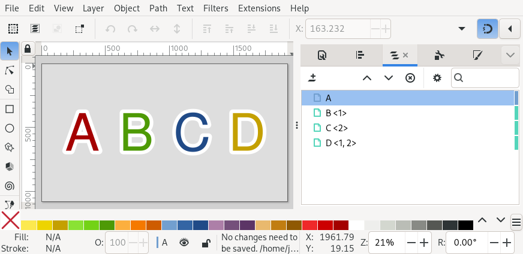
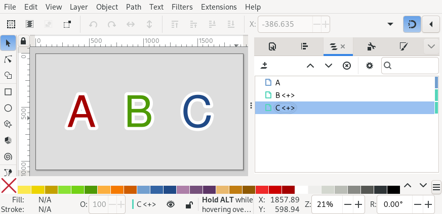
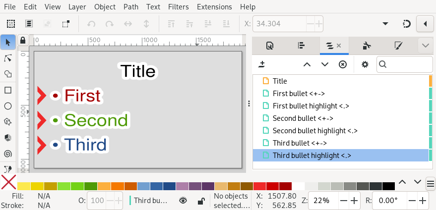
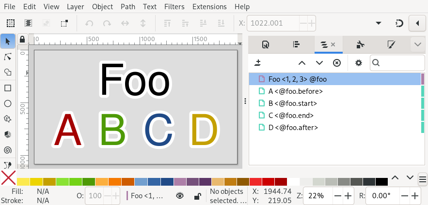

.. _builds:

Builds
======

Builds are controlled using special annotations added to Inkscape layer names
with a `Beamer <https://en.wikipedia.org/wiki/Beamer_(LaTeX)>`_-inspired
syntax.

Build *specifications* are given in angle brackets (`<` and `>`) anywhere
within the layer name and consist of a comma separated list of *step* numbers
during which that layer is visible.

For example if you have a slide with four layers named :download:`like so
<_static/examples/simple_steps/100_simple_steps.svg>`:

* A
* B <1>
* C <2>
* D <1, 2>.


        An Inkscape SVG with layers named 'A', 'B <1>', 'C <2>' and 'D <1, 2>'.

This describes a slide which builds in three steps (numbered 0, 1 and 2):

* In step 0 (the initial state of the slide), only layer A is visible.
* In step 1 (after the first click), layers A, B and D are visible.
* In step 2 (after the second click), layers A, C and D are visible.


        The three slides, side by side.


Ranges
------

You can also specify ranges of steps, for example, given :download:`the
following layers <_static/examples/simple_range/100_simple_range.svg>`:

* A <1>
* B <2>
* C <3>
* D <0-2>

.. image:: _static/examples/simple_range_inkscape_screenshot.png
    :alt: 
        An Inkscape SVG with layers named 'A <1>', 'B <2>', 'C <3>' and 'D
        <0-2>'.

This slide will build in four steps like so:

* In step 0 (the initial state of the slide), only layer D is visible.
* In step 1 (after the first click), layers A, D are visible.
* In step 2 (after the second click), layers B and D are visible.
* In step 3 (after the third click), only layer C is visible.


        The four slides, side by side.

Open-ended ranges
-----------------

If the start or end of a range is omitted, this defines a range from the first
step or to last step respectively. For example ``<2->`` means from the second
click onward.


Automatic step numbering
------------------------

For the common case where consecutive layers are revealed in consecutive steps
the ``+`` shorthand means the step after the first step in the previous layer
with a specification. For example:

* A
* B <+>
* C <+>


        An Inkscape SVG with layers named 'A', 'B <+>' and 'C <+>'.

Here, layer A is always visible whilst layers B C appear (then disappear) after
the first and second clicks respectively.


        The three slides, side by side.

A '+' can be used as part of a range specification. In addition the ``.``
shorthand works like ``+`` but without incrementing the step number. Used
together this allows you to something like follows:

* Title
* First bullet <+->
* First bullet highlight <.>
* Second bullet <+->
* Second bullet highlight <.>
* Third bullet <+->
* Third bullet highlight <.>


        An Inkscape SVG with layers named as above.


This slide has four steps with (for example) a bullet being reveled after each
click. The most recently shown bullet might be highlighted in some way in the
'highlight' layers.


        The four slides, side by side.


Tags
----

For advanced (or fiddly) usecases, it is possible to add one or more tags to a
layer by including ``@tag_name_here`` to their name. These tags may be referenced
in build specifications to make layers appear in sync with eachother.

A typical use of this feature is for cases where graphics are split between
foreground and background layers and need to be built in sync. For example,
consider the following layers:

* Foreground
    * Foreground A <+-> @a
    * Foreground B <+-> @b
    * Foreground C <+-> @c
* Background
    * Background A <@a>
    * Background B <@b>
    * Background C <@c>

This slide builds in four steps with foreground layers A, B and C being
revealed after each click. The corresponding background layers are revealed in
sync with their foreground counterparts.

.. seealso::

    :ref:`links_tags`
        Tag names may also be referenced in inter-slide hyperlinks. For
        example, ``#10@foo`` to link to the first build step on slide 10 with
        the tag 'foo'.


Tag suffixes
````````````

By default, when you use a tag in a build specification, *all* of the steps of
layers with that tag are, in effect, copied into your specification.

By adding a ``.start``, ``.end``, ``.before``, or ``.after`` suffix, you can instead
reference the first or last steps layers with that tag are visible. For
example, given the following layers:

* Foo <1, 2, 3> @foo
* A <@foo.before>
* B <@foo.start>
* C <@foo.end>
* D <@foo.after>


        An Inkscape SVG with layers named as above.

This defines a slide with five build steps:

* In step 0, just layer A is visible
* In step 1, layers Foo and B are visible
* In step 2, just layer Foo is visible
* In step 3, layers Foo and C are visible
* In step 4, just layer D is visible


        The five slides, side by side.

.. note::

    The astute reader may have noticed that ``@*.before`` syntax could lead to
    referencing steps numbered less than zero. Slidie will handle this scenario
    (steps will start from -1, or -2, or whatever is necessary, on that slide)
    but you still can't explicitly write negative step numbers.


Tags in ranges
``````````````

When a tag is used in a range specification without a suffix, the ``.start`` and
``.end`` suffixes are implied for the start end end of the range. That is,
``<@foo-@bar>`` is treated as ``<@foo.start-@bar.end>``.


Sharing tags
````````````

Many layers may be labelled with the same tag. In this case, referencing that
tag refers to the union of all steps those layers are visible. For example,
given the layers:

* A <1> @foo
* B <2> @foo
* C <@foo>

Layer 'C' will be visible at the same time as both layers 'A' and 'B'.


Limitations of tags
```````````````````

There are two major limitations to the use of tags in build specifications:

Firstly, circular dependencies between layers via tags are not permitted and
will result in an error.

Secondly, automatic step numbering (i.e. ``+`` and ``.``) will ignore any tag
references when computing the number to use. For example given the layers:

* A <1> @foo
* B <@foo, 2>
* C <.>

Here the ``.`` in layer C resolves to 2 (not 1) because 2 is the first non-tag
step in the layer B's build specification.
