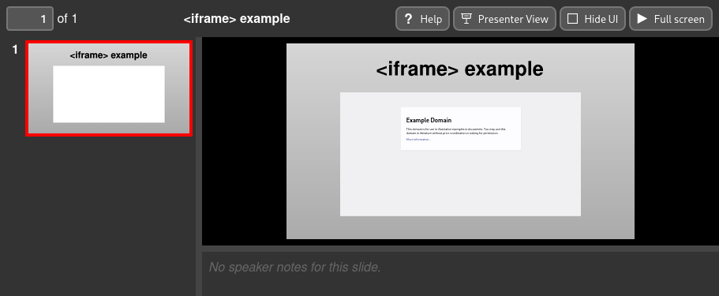

.. _iframe:

Creating ``<iframe>`` elements
==============================

Slidie supports the inclusion of `inline frames (iframes)
<https://developer.mozilla.org/en-US/docs/Web/HTML/Element/iframe>`_ in slides
when viewed in a web browser using the :ref:`XHTML output format
<rendering-xhtml>`. This relatively powerful feature enables you to embed
arbitrary web content into your presentations. At its simplest, this can
provide a simple browser instance within your presentation for demonstrating
some website or application. It could also be used as the basis for developing
custom live and/or interactive widgets for use in demonstrations: you have the
full web platform at your disposal!

.. image:: _static/examples/simple_iframe_inkscape_screenshot.png
    :alt:
        A screenshot of an iframe defined in Inkscape using Slidie's magic text
        feature.


        A screenshot of an iframe displayed on a slide.


Inserting an iframe
```````````````````

To insert an iframe into a slide, insert a :ref:`placeholder rectangle or image
<magic-rectangles>` grouped with a :ref:`magic text <magic-text>` box with one
of the following forms:

::

    @@@
    iframe = "<URL here>"  # Short form

::

    @@@
    # Long form
    [iframe]
    url = "<video URL here>"
    query = []  # Extra query parameters to append to the URL. Optional.
    scale = 1.0  # Scaling factor for the displayed content. Optional.
    name = "<name here>"  # HTML name attribute for the iframe. Optional.

The purpose of the optional parameters is explained in subsequent sections.

.. note::

    If an iframe grabs, or is given, focus, slidie becomes unable to
    intercept keyboard shortcuts to advance through slides.

.. warning::

    Some websites use various means to prevent their loading within iframes and
    so can't be used.

.. warning::

    Browsers often enforce fairly strict (and complicated) security rules
    around iframes. Most notably, Firefox will, in certain situations, prevent
    the user from interacting with iframes in pages loaded from ``file://``
    URLs. For this reason, if you're doing anything complex with iframes, it
    might be necessary to serve the XHTML viewer from a web server (e.g.
    ``python -m http.server``.


.. warning::

    All iframes on all slides are be loaded as soon as the viewer is opened and
    remain loaded regardless of their visibility. Beware of the potential
    resources consumed and audio playback.
    
    A future version of slidie might add a `postMessage()
    <https://developer.mozilla.org/en-US/docs/Web/API/Window/postMessage>`_
    based API to inform iframes whether they are visible or not.


Appending URL query parameters
``````````````````````````````

The ``query`` parameter of the long-form magic text value may be used to append
extra query parameters to the provided URL. This may be convenient if you're
developing some widget for inclusion in your slides which is controlled by
query parameters since slidie will handle the URL encoding of values for you.

The query parameter may be specified in any of the two following forms:

::

    # Adds: foo=bar&baz=qux&baz=quo
    query.foo = "bar"
    query.baz = ["qux", "quo"]  # Repeated query parameters


::

    # Adds baz=qux&foo=bar&baz=quo
    query = [
        {name="baz", value="qux"},
        {name="foo", value="bar"},
        {name="baz", value="quo"},
    ]

The latter form is more verbose but makes it possible to control the relative
order and interleaving of repeated query parameters.


Scaling
```````

By default, the contents of the iframe will be scaled such that when the slide
is displayed at its 'native' size, the iframe contents will also be rendered at
their native size. Likewise, if the slide is shown smaller (or larger) on
screen, the iframe's contents will be scaled accordingly.

For example, in the example screenshot above, the slide has a native size of
1920x1080 and so the example.com page appears very small in the scaled-down
view of the slide.

The optional ``scale`` parameter may be used to force the iframe contents to be
rendered at a larger or smaller than usual scale. For example, setting
``scale`` to 2 will cause the iframe contents to be rendered at twice the
native size. This may be helpful for making text more ledgible when slides are
being shown on a projector or shared display.

.. tip::

    SVG transforms (and filter effects) applied to your placeholder rectangle
    will be applied to the resulting iframe as displayed in your browser. This
    means that you can create distorted browser windows which still function
    correctly -- including accepting input, albeit with unusual shapes.

.. note::

    Slidie goes to great lengths to achieve the scaling regime it does since
    the default scaling behaviour is almost never what you want, especially for
    Inkscape-authored SVGs whose document scaling factors are often arbitrary.
    You can, however, use the 'native' scaling by setting ``scale`` to 0.


Opening hyperlinks in an iframe
```````````````````````````````

It is possible to add hyperlinks to your slides which open within an embedded
iframe on that slide when clicked.

First, give the target iframe a name using the optional ``name`` parameter.
This assigns a `HTML name attribute
<https://developer.mozilla.org/en-US/docs/Web/HTML/Element/iframe#name>`_ to
the iframe.

Next, create a hyperlink in your SVG, setting the 'Target' to the name you gave
your iframe.

.. tip::

    You can create hyperlinks directly in Inkscape by right-clicking an object
    and picking 'Create anchor (hyperlink)'.

