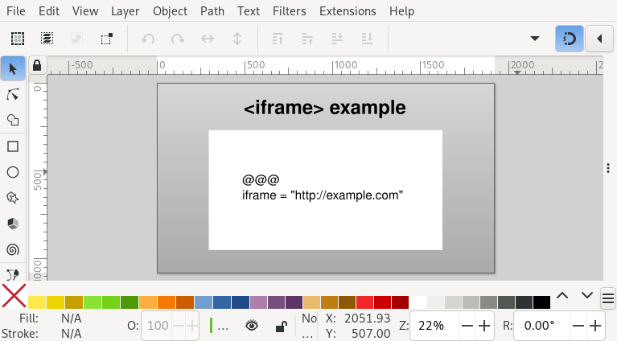

.. _iframe:

Creating ``<iframe>`` elements
==============================

Slidie supports the inclusion of `inline frames (iframes)
<https://developer.mozilla.org/en-US/docs/Web/HTML/Element/iframe>`_ in slides
when viewed in a web browser using the :ref:`XHTML output format
<rendering-xhtml>`. This relatively powerful feature enables you to embed
arbitrary web content into your presentations.



        A screenshot of an iframe defined in Inkscape using Slidie's magic text
        feature.

.. image:: _static/examples/simple_iframe.png
    :alt:
        A screenshot of an iframe displayed on a slide.

At its simplest, an iframe can act as a basic web browser within your slide for
demonstrating some website or application. It could also be used as the basis
for developing custom live and/or interactive widgets for use in
demonstrations: you have the full web platform at your disposal!

.. seealso::

    `slidie-ttyd <https://github.com/mossblaser/slidie-ttyd>`_
        An interactive terminal widget you can insert into your slides using
        iframes.


Inserting an iframe
```````````````````

To insert an iframe into a slide, insert a :ref:`placeholder rectangle or image
<magic-rectangles>` grouped with a :ref:`magic text <magic-text>` box with one
of the following forms:

::

    @@@
    iframe = "<URL here>"  # Short form

::

    @@@
    # Long form
    [iframe]
    url = "<video URL here>"
    query = []  # Extra query parameters to append to the URL. Optional.
    scale = 1.0  # Scaling factor for the displayed content. Optional.
    name = "<name here>"  # HTML name attribute for the iframe. Optional.

The purpose of the optional parameters is explained in subsequent sections.

.. note::

    If an iframe grabs, or is given, focus, Slidie becomes unable to
    intercept keyboard shortcuts to advance through slides. Beware of creating
    full-screen iframes!

.. tip::

    Some browsers will treat an 'Escape' key pressed within an iframe as a
    command to leave full-screen mode when entered by the 'Full screen' button
    in the XHTML viewer.
    
    If you want to be able to type an 'Escape' within an iframe, try using the 'Hide
    UI' button and the browser's own full-screen function (e.g. by pressing
    F11). In this mode, browsers won't usually intercept the 'Escape' key.

.. warning::

    Some websites deliberately prevent themselves being loaded within iframes.
    Unfortunately there is no workaround for this.

.. warning::

    Browsers often enforce fairly strict (and complicated) security rules
    around iframes. Most notably, Firefox will, in certain situations, prevent
    the user from interacting with iframes in pages loaded from ``file://``
    URLs. For this reason, if you're doing anything complex or interactive with
    iframes, it might be necessary to serve the XHTML viewer from a web server
    (e.g.  ``python -m http.server``).


.. warning::

    All iframes on all slides are be loaded as soon as the viewer is opened and
    remain loaded regardless of their visibility. Beware of the potential
    resources consumed and potential for background audio playback.
    
    A future version of Slidie might add a `postMessage()
    <https://developer.mozilla.org/en-US/docs/Web/API/Window/postMessage>`_
    based API to inform iframes whether they are visible or not. It might also
    allow them to be loaded and unloaded depending on slide visibility.


Appending URL query parameters
``````````````````````````````

The ``query`` parameter of the long-form magic text value may be used to append
extra query parameters to the provided URL. This may be convenient for
controling custom widgets within iframes. Slidie handles details URL encoding
for you making it easy to pass in arbitrary data.

Query parameters may be specified in one of the two following forms:

*Concise form:*
    ::

        # Adds: foo=one&baz=two&baz=three
        query.foo = "one"
        query.bar = ["two", "three"]  # Repeated query parameters in a list


*Verbose form (allowing arbitrary paramter ordering):*
    ::

        # Adds foo=one&bar=two&foo=three
        query = [
            {name="foo", value="one"},
            {name="bar", value="two"},
            {name="foo", value="three"},
        ]

The latter form is more verbose but makes it possible to control the relative
order and interleaving of repeated query parameters.


Scaling
```````

By default, the contents of iframes will be scaled such that when the slide is
displayed at its 'native' size, the iframe contents will also be rendered at
their native size. Likewise, if the slide is shown smaller (or larger) on
screen, the iframe's contents will be scaled accordingly.

For example, in the example screenshot above, the slide has a native size of
1920x1080 and so the example.com page appears very small in the small
viewer window shown above.

The optional ``scale`` parameter may be used to apply a scaling factor the
iframe contents. For example, setting ``scale`` to 2 will cause the iframe
contents to be rendered at twice the native size. This can be helpful for
making text more ledgible when slides are being shown on a projector or shared
display.

.. tip::

    SVG transforms (and filter effects) applied to your placeholder rectangle
    will be applied to the resulting iframe as displayed in your browser. This
    means that you can create distorted browser windows which still function
    correctly, including accepting input.

.. note::

    The scaling rules used for iframes by Slidie differ from the native SVG
    behaviour because the latter is almost never what you really want. This is
    particularly true for Inkscape-authored SVGs whose internal document
    scaling factors are often arbitrary. If you *really* want the native
    scaling behaviour, however, set ``scale`` to 0.


Opening hyperlinks in an iframe
```````````````````````````````

It is possible to insert hyperlinks into your slides which open their targets
within an embedded iframe rather than a new window.

First, give the target iframe a name using the optional ``name`` parameter.
This assigns a `HTML name attribute
<https://developer.mozilla.org/en-US/docs/Web/HTML/Element/iframe#name>`_ to
the iframe.

Next, create a hyperlink in your SVG, setting the 'Target' to the name you gave
your iframe.

.. tip::

    You can create hyperlinks directly in Inkscape by right-clicking an object
    and picking 'Create anchor (hyperlink)'.

