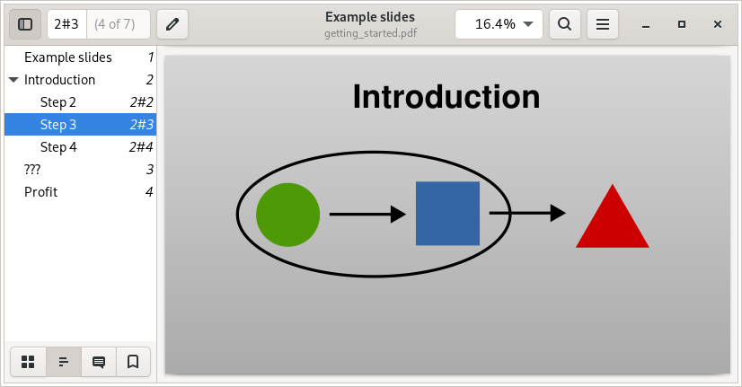

.. _rendering:

``slidie`` command
==================

The ``slidie`` command is used to build a slide show from a set of source SVG
files.

Usage is as follows::

    $ slidie [SOURCE ...] [--output OUTPUT]

If the source is omitted, slidie will look for slide SVGs in the current
directory. Otherwise, the source can be a directory name (containing
:ref:`numbered <file-numbering>` SVG files) or an explicit list of SVG files
(which need not be numbered and will be combined in the order given).

.. tip::

    The ability to specify individual SVG files to render can be useful when
    you're iterating on one slide within a much larger slide show. This way you
    can avoid recompiling every slide.

The output filename defaults to ``out.xhtml`` and the extension chosen controls
the output format produced. Supported extensions are ``.xhtml``, ``.pdf`` and
``.png``. See the sections below for details of the various formats.


.. _rendering-formats:

Supported output formats
------------------------

Slidie supports several output formats suitable for different purposes:

:ref:`XHTML <rendering-xhtml>`
    A standalone, single-file, fully-offline browser-based slide viewer
    application. The most feature complete output format. Also includes
    utilities such as a presenter view.

:ref:`PDF <rendering-pdf>`
    A bog-standard PDF file, universally viewable and good for public
    distribution. Lacks support for more dynamic content (e.g. videos).

:ref:`PNG <rendering-png>`
    Simple (bitmap) image files, one per slide. Useful for importing into
    (e.g.) video editors or other forms. Obviously lacks selectable/searchable
    text as well as support for more dynamic content (e.g. videos).

+----------------------------------------+------------+------------+------------+
| Feature                                | XHTML      | PDF        | PNG        |
+========================================+============+============+============+
| Static SVG graphics                    | ✔ [#f1]_   | ✔          | ✔          |
+----------------------------------------+------------+------------+------------+
| Embedded fonts                         | ✔          | ✔          | ✔          |
+----------------------------------------+------------+------------+------------+
| Importable into other tools            | --         | ✔          | ✔          |
+----------------------------------------+------------+------------+------------+
| Slide :ref:`builds <builds>`           | ✔          | ✔          | ✔          |
+----------------------------------------+------------+------------+------------+
| :ref:`Hyperlinks <links>`              | ✔          | ✔          | --         |
| (including between slides)             |            |            |            |
+----------------------------------------+------------+------------+------------+
| :ref:`Presenter view <presenter-view>` | ✔          | --         | --         |
+----------------------------------------+------------+------------+------------+
| :ref:`Speaker notes <speaker-notes>`   | ✔          | -- [#f2]_  | --         |
+----------------------------------------+------------+------------+------------+
| :ref:`Video <video>`                   | ✔ [#f3]_   | --         | --         |
+----------------------------------------+------------+------------+------------+
| :ref:`IFrames <iframe>`                | ✔ [#f3]_   | --         | --         |
+----------------------------------------+------------+------------+------------+

.. [#f1] Whilst browsers now have very good SVG support, there are still some
         more difficult features (such as masking) which remain hit-or-miss.

.. [#f2] Support for incorporating speaker notes into PDF comments may be
         implemented in the future.

.. [#f3] Videos and IFrames are not supported on Webkit based browsers (e.g.
         Safari) due to rendering bugs in that browser engine at the time of
         writing. This might one day fix itself.


.. _rendering-xhtml:

XHTML
`````

The XHTML output format generates a completely self-contained :ref:`slide
viewing and presenting application <xhtml-viewer>` which can be opened directly
by modern browsers with no need for a web server or internet connection.

.. image:: _static/xhtml_viewer.png
    :alt: The XHTML viewer application open in a browser.

.. note::

    Slidie generates XHTML, not HTML, since it directly incorporates full
    (XML-based) SVG files and depends on XML processing features not available
    in regular HTML documents. 

Whilst the XHTML viewer application can be hosted on a web server, it is
designed to function correctly when loaded directly from a ``file://`` URL.

.. warning::

    Some browsers place extra restrictions on :ref:`IFrames <iframe>` when
    running from a ``file://`` URL. This can cause embedded IFrames to silently
    ignore keyboard and mouse input. In this situation, using a simple web
    server (e.g. ``python -m http.server``) might be necessary.

The generated file is entirely self-contained, including all slide graphics,
fonts and the viewer application and should be openable on other systems.

.. note::

    Unfortunately there is not a straightforward mechanism to do automatic font
    embedding in the general case due to the need to convert fonts to web
    fonts. Instead, Slidie converts all slide text to paths which ensure
    correct display on any system. To enable accessability and selectability,
    invisible text elements are overlaid on top.

.. seealso::

    :ref:`xhtml-viewer`
        See for more information on using the XHTML viewer application.


.. _rendering-pdf:

PDF
```

The PDF output format is fairly self explanatory but includes a few noteworthy
features:

* Slide-oriented page numbering based on :ref:`slidie's link syntax <links>`.
* Document title, author and date metadata taken from the first slide's
  :ref:`metadata <metadata>`.
* Table-of-contents based on :ref:`slide metadata <metadata>`.
* Image de-duplication (an image included on multiple slides will only be
  stored once in the PDF file).
* Font embedding.


          custom page numbering.


.. _rendering-png:

PNG
```

The PNG output format writes each :ref:`build step <builds>` each of slide to
an individual PNG file.

.. image:: _static/examples/getting_started_png_montage.png
    :alt: A montage of several slides rendered as PNG files.

The resolution of the generated PNGs may be overriden from the default of 96
DPI using the ``--png-dpi`` argument.

By default, PNGs will be rendered with fully-opaque backgrounds. This may be
overridden using the `--png-background-opacity`` argument.

The generated PNGs are assigned ascending numbers (starting from 1).

By default a ``NNN_`` prefix is added to the supplied filename where ``NNN`` is
the three-digit zero-padded number assigned to that file. Alternatively, if the
filename contains a valid `Python format string placeholder for an integer
<https://docs.python.org/3/library/string.html#formatstrings>`_ (e.g.
``{:03d}``), the specified filename template is used instead.

.. note::

    The generated PNG file numbers bear no relationship with the source SVG
    :ref:`file numbers <file-numbering>`.
