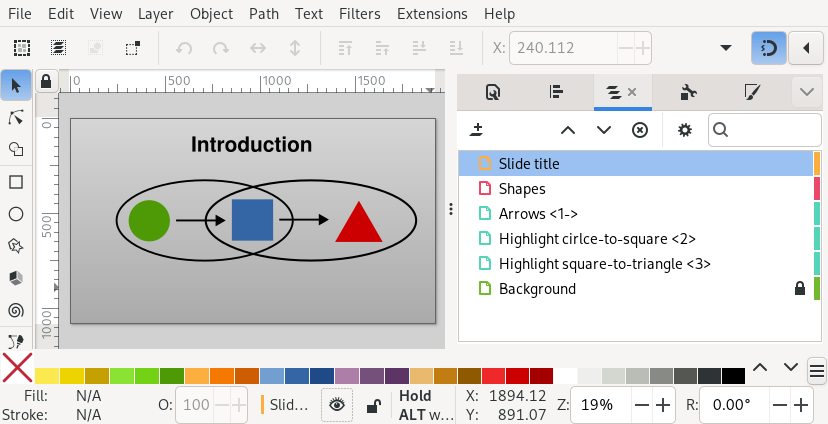
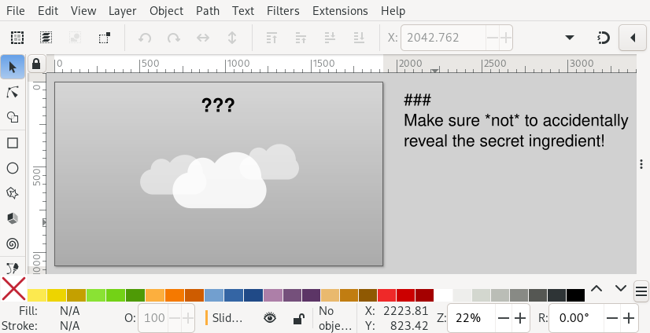
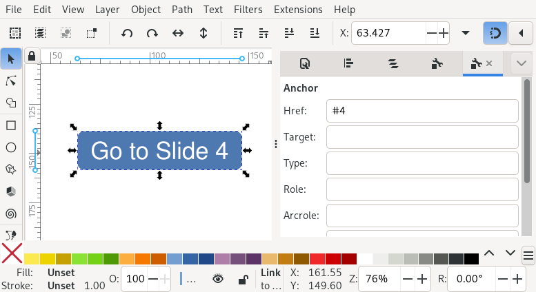

.. _tour:

Slidie Guided Tour
==================

This document provides a very high-level guided tour of many of Slidie's main
features, with links to more in-depth documentation as required.

Part 0: Create some slides
--------------------------

Lets start by creating some very simple slides. This is as easy as creating
slide-shaped SVGs using Inkscape.

A 1920x1080 pixel page size works well for slides and can be set in the
'Document Properties' panel (found in the 'File' mennu).

Since slides are usually intended for screen display I like to switch the
display units to pixels too.

.. image:: _static/document_properties.png
    :alt:
        The document properties panel with 1920x1080 pixel size and pixel units
        set.

Each SVG file's name must begin with a number which controls the order in which
the slides will be included in the show. For example, you might name your files
like:

* ``100 - Title.svg``
* ``200 - Overview.svg``
* ...
* ``1400 - Conclusions.svg``

.. tip::

    Using BASIC-style numbering makes reordering slides easier.

Part 1: Render your slides
--------------------------

To render your slides into a standalone XHTML viewer, PDF, or directory full of
PNG images, use the ``slidie`` command::

    $ cd path/to/slides/
    $ slidie

By default, slidie will build the slides in the current directory into a
standalone XHTML file called ``out.xhtml`` which can be opened directly in your
web browser (no server required). Slidie XHTML files are completely self
contained and can be distributed independently of the source SVG files.

.. image:: _static/xhtml_viewer.png
    :alt: The XHTML viewer showing an example presentation.

You can override the output filename using the ``--output``/``-o`` argument::

    $ slidie --output my_presentation.xhtml

Slidie can also render your slides as a PDF: just specify a ``.pdf`` filename::

    $ slidie --output out.pdf

In general, the XHTML format supports more features (e.g. videos and presenter
view) whilst the PDF format is more useful as a distribution or archival
format.

.. seealso::
    
    :ref:`xhtml-viewer`
        For more details on how to use the XHTML viewer application.
    
    :ref:`rendering`
        For details of all supported output formats.

Part 2: Reordering slides
-------------------------

Using BASIC-style numbers for your slides (i.e. incrementing by 100) makes it
easier to change the relative ordering of slides. For example, given the
following:

* 100 - a.svg
* 200 - b.svg
* 300 - c.svg

You can move the slide 'C' between 'A' and 'B' by renumbering it to 150.

To make this process easier, Slidie includes the ``slidie-mv`` command. You
could achieve the same reordering as the example above using::

    $ slidie-mv "300 - c.svg" --before "200 - b.svg"

You can alternatively use ``--after <slide>``, ``--start`` or ``--end`` to
specify the target location. You can also move several slides in one go.

If no gap in numbering exists, the ``slidie-mv`` command will attempt to rename
a minimum of other slides to make the slides fit.

.. seealso::

    :ref:`slidie-mv`
        Full command usage reference.

Part 3: Build up a slide step-by-step
-------------------------------------

Sometimes it is useful to build up the displayed contents of a slide over
several steps. Slidie allows you to reveal (or hide) layers step-by-step by
adding special annotations to layer names.

The simplest type of annotation looks like ``<1>`` or ``<2-4>`` and indicates
that the layer should be visible only during step 1 or steps 2, 3 and 4
(respectively). The screenshot below shows :download:`an example SVG
<_static/examples/getting_started/00200 - Introduction.svg>` which specifies a
slide where different layers are displayed at different points in time:

        Screenshot of Inkscape with layers containing Slidie build
        specifications

The resulting four steps are shown below.

.. image:: _static/build_steps.png
    :alt:
        The resulting slides produced by the previous example.

In this example, the layer named 'Arrows <1->' only becomes visible from step
one (note that the first step is number zero). The ending step is omitted
meaning the layer will be visible on all remaining steps.

The two 'Highlight ...' layers are only shown for a single step (specifying
step 2 and 3 respectively).

Layers without a build step annotation will be visible on all steps (or hidden
if you've hidden them in Inkscape).

The complete syntax for build specifications includes many more features
including automatic numbering and connecting the visibility of groups of
layers. See the :ref:`documentation <builds>` for a complete introduction.

.. seealso::

    :ref:`builds`
        For a complete introduction to Slidie's build syntax.

Part 4: Add speaker notes
-------------------------

To add speaker notes to a slide, create a text box and type ``###`` (three
hashes) followed by a newline. Add your speaker notes to the remaining lines.

        A screenshot of Inkscape with a set of speaker notes.

When the slides are rendered, the notes will be displayed in the notes area
(and presenter view) of the XHTML viewer.

.. image:: _static/speaker_notes_viewer_screenshot.png
    :alt:
        A screenshot of the XHTML viewer showing some speaker notes.

Whilst text formatting applied to the speaker notes in your source file are
lost, the notes will be formatted as Markdown_ in the XHTML viewer.

.. _Markdown: https://en.wikipedia.org/wiki/Markdown

Though it is probably most readable to place your speaker notes off the side of
the page in your SVG, it is not necessary: Slidie removes the text from the
slide during rendering.

If you place speaker notes on layers selectively displayed during a build up,
those notes will be shown faded-out in the viewer before that build step is
reached.

.. note::

    Speaker notes are, unfortunately, currently only available in the XHTML
    viewer and are inaccessible in other output formats.

Part 5: Create clickable links between slides
---------------------------------------------

You might not have realised but Inkscape allows you to create hyperlinks in
your SVGs by right clicking an object and clicking 'Create anchor
(hyperlink)'.

You can create links to external resources by entering an ordinary URL in the
'Href' box of the 'Link properties' panel.

.. tip::

    When linking to external resources, set the target to ``_blank`` to make
    the link open in a new window (rather than navigating away from the XHTML
    viewer!).

To create a link to another slide, make a link like ``#NNN``. For example, to
create a link to the fourth slide use ``#4`` (slides are numbered from '1').

        A screenshot showing setting up a hyperlink in Inkscape

You can also link to a specific build step on a slide using syntax
``#NNN<MMM>`` which links to slide ``NNN``, step ``MMM``. To link to a
particular build step on the *current* slide, just use ``#<MMM>``.

.. seealso::

    :ref:`links`
        For a complete introduction to the inter-slide link syntax. You can
        also learn how to reference slides and steps using user-defined names
        to avoid relying on brittle slide and step numbers.

.. tip::

    The XHTML viewer places the current slide number in the URL bar and you can
    test link definitions by typing them there, or in the slide number box at
    the top left.

Part 6: Add a video clip (and Slidie's magic text feature)
----------------------------------------------------------

Slidie supports the inclusion of a number of dynamic elements not natively
supported by SVG such as videos and iframes (embedded web browsers). These
inclusions make use of a Slidie feature (nerve-wrackingly) called 'magic text'.

In this example, lets insert a video into a slide, draw a rectangle where the
video should appear and then, on top, add a text box containing something like
the following::

    @@@
    video = "path/or/url/to/video.mp4"

Finally, combine the rectangle and text in a group.

.. image:: _static/video_inkscape_screenshot.png
    :alt:
        A screenshot of a video defined in Inkscape using Slidie's magic text
        feature.

The ``@@@`` syntax marks what follows as a 'magic' text block which Slidie will
treat specially. In this case, we've indicated that we want to substitute the
grouped rectangle with a video player. If we render our slide we get something
like this:

.. image:: _static/video_viewer_screenshot.png
    :alt:
        A screenshot of a video playing on a slide.

In PDF and PNG outputs Slidie will only show the placeholder rectangle. (This
is true of the XHTML viewer's slide thumbnails too!) To make it more obvious
what's going on, you can replace the rectangle with an image to use as a
placeholder. The ``slidie-video-stills`` command is provided which can do this
automatically::

    $ slidie-video-stills path/to/slide.svg

.. warning::
    
    Unlike other media, Slidie does *not* embed video data into the XHTML
    output format. For local video files, you must take care to distribute the
    video files and viewer together.
    
    This situation is not ideal but is currently neccessary because of the
    limited size of `data URLs
    <https://developer.mozilla.org/en-US/docs/Web/HTTP/Basics_of_HTTP/Data_URLs>`_
    supported by major browsers.

.. note::
    
    Videos are only supported in Slidie's XHTML output format. When exported to
    other formats, the placeholder rectangle or image will be shown instead.
    
    Whilst PDF does *technically* support embedding videos, viewer support is
    typically crude, janky or most often missing entirely. Further, producing a
    standards-conforming PDF with an embedded video supported by the few
    capable PDF viewers involves both Flash media player binaries and blobs of
    Javascript calling undocumented APIs. Its really bad. In short, the author
    decided that implementing this feature would be in poor taste, not to
    mention of limited practical value.

.. seealso::

    :ref:`video`
        For further details of Slidie's video embedding support.

    :ref:`iframe`
        For how to conveniently embed iframes (i.e. web browsers) into slides.
        This is a potentially powerful mechanism for injecting complex
        interactive or live data connected elements into slides.

    :ref:`magic-text`
        For details of the magic text syntax and its other uses.
